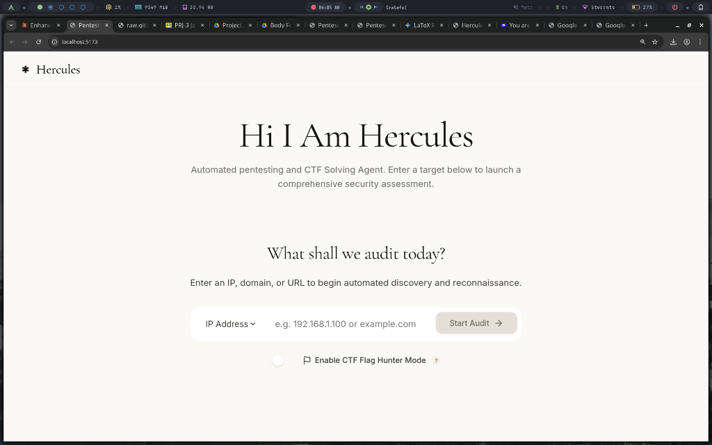
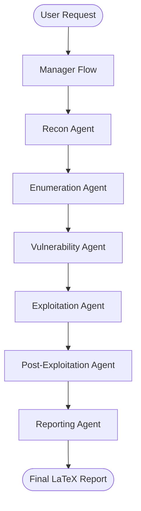
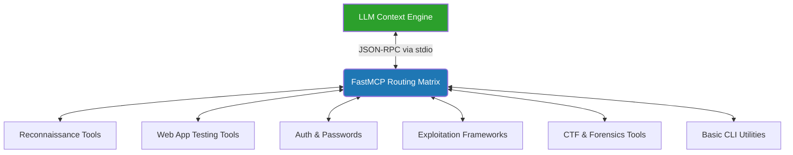

# 🛡️ Hercules: Automated Penetration Testing & CTF Platform


Hercules is a professional-grade, autonomous penetration testing and Capture The Flag (CTF) solving platform. It orchestrates intelligent AI agents using **CrewAI**, connects them to real-world offensive security tools via the **Model Context Protocol (MCP)**, and provides a sleek, real-time command center interface built with **React** and **FastAPI**.

---

## 📸 Command Center



---

## 🌟 Key Features

- **Autonomous Agentic Workflows:** Multi-agent collaboration following a strict offensive security methodology (Recon → Enumeration → Vulnerability Analysis → Exploitation → Post-Exploitation → Reporting).
- **FastMCP Security Toolkit:** A unified local server exposing **61 distinct security tools** across 6 categories (Nmap, Metasploit, Nuclei, FFuf, SQLMap, Gobuster, Hydra, John, and more).
- **Real-Time Command Center:** A stunning Dark Mode React frontend featuring a live terminal feed, phase tracking, and direct report viewing.
- **CTF & Professional Modes:** Toggle between active exploitation (CTF Mode) and safe, detection-only behavior (Professional Audit Mode).
- **Automated Reporting:** Generates professional, executive-ready PDF reports using LaTeX, compiling findings without ever exposing the reporting agent to external execution environments.
- **Powered by Gemini:** Utilizes Google's advanced Gemini models via LiteLLM for deep cognitive reasoning and complex vulnerability chaining.

---

## 🏗️ Architecture

Hercules utilizes a **Hub-and-Spoke** architecture to ensure secure execution and millisecond response times. 

### 1. Agent Workflow



### 2. FastMCP Tool Architecture



1. **Frontend (React + Vite):** The user interface (`Hercules/frontend`).
2. **Backend (FastAPI):** Orchestrates CrewAI agents and streams live updates via WebSockets (`Hercules/backend`).
3. **CrewAI Agents:** Specialized crews handle specific phases of the pentest lifecycle (`Hercules/crews`).
4. **FastMCP Server:** The central execution matrix running completely isolated from the main application, executing sanitized CLI commands (`MCP/`).

### System Overview
```text
Agent/
├── Hercules/                ← Core Orchestration Platform
│   ├── backend/             ← FastAPI server & WebSocket manager
│   ├── frontend/            ← React UI (Live feed, command bar)
│   ├── crews/               ← CrewAI definitions (Recon, WebApp, Exploit, etc.)
│   └── flows/               ← Stateful pentest execution flow
├── MCP/                     ← FastMCP Security Toolkit (Isolated Tool Executor)
│   ├── server.py            ← Exposes 61 JSON-RPC tools to agents
│   └── tools/               ← Wrappers for Metasploit, Nmap, Nuclei, etc.
├── report/                  ← Output directory for generated PDF reports
└── README.md                ← This document
```

---

## 🚀 Quick Start

### 1. Prerequisites
- **Python 3.12+**
- **Node.js 18+** & `npm`
- **uv** (Recommended Python package manager)
- **Local Security Tools:** Ensure underlying binaries (e.g., `nmap`, `ffuf`, `nuclei`, `sqlmap`, `msfconsole`) are installed on your Linux/Kali host.

### 2. Environment Setup
Copy the example environment file and configure your API keys (specifically Gemini for the LLM engine):
```bash
cp .env.example .env
# Edit .env and add your GEMINI_API_KEY
```

### 3. Start the Suite
Hercules includes a convenient startup script that launches both the FastAPI backend and the Vite frontend simultaneously, while automatically spinning up the MCP tool server in the background:

```bash
python Hercules/start.py
```

- **Frontend UI:** `http://localhost:5173`
- **Backend API:** `http://localhost:8000`

---

## 🛡️ FastMCP Tool Categories

The isolated MCP Server exposes tools grouped by offensive capabilities:

| Category | Tools | Description |
|----------|-------|-------------|
| **Recon & Scanning** | `nmap`, `gobuster`, `nuclei` | Network mapping and template-based scanning |
| **Web App Testing** | `ffuf`, `sqlmap`, `dalfox`, `arjun`, `wafw00f` | Fuzzing, SQLi detection, XSS, and WAF discovery |
| **Auth & Password** | `hydra`, `john` | Brute-forcing and hash cracking |
| **CTF & Forensics** | `volatility3`, `exiftool`, `steghide` | Memory analysis and steganography |
| **Exploitation** | `metasploit`, `searchsploit` | Active payload generation and Exploit-DB |
| **Basic CLI** | `curl`, `netcat`, `ssh`, `dig`, `grep` | Fundamental networking and text manipulation |

*Note: The tools listed above are just a subset. The Hercules platform includes over 61 distinct tool functions across these categories to handle almost any offensive scenario.*

---

## 🔒 Security & Safety

- **No Arbitrary Shell Execution:** Agents interact via strict JSON-RPC functions. `shell=True` is explicitly banned.
- **Reporting Isolation:** The `ReportingAgent` has zero execution capabilities to prevent prompt injection and data exfiltration during report formatting.
- **Input Sanitization:** MCP wrappers enforce robust escaping of shell metacharacters before handing them off to `subprocess`.

---

## 🧪 Testing

The platform includes comprehensive test suites covering both the MCP execution layer and the asynchronous execution flows.

```bash
# Run backend and MCP tests
cd Hercules
pytest tests/ -v
```

## 📜 License & Disclaimer

**For Educational and Authorized Auditing Purposes Only.**

Hercules was designed to empower security professionals and streamline Capture The Flag competitions. **The creator and contributors of this project are not responsible for any misuse, damage, or illegal activities caused by this tool.** 

By using Hercules, you explicitly agree that:
1. You are solely responsible for your actions.
2. You will only use this tool against infrastructure you own or have explicit, documented permission to test.
3. You will comply with all local, state, and international cyber laws.
